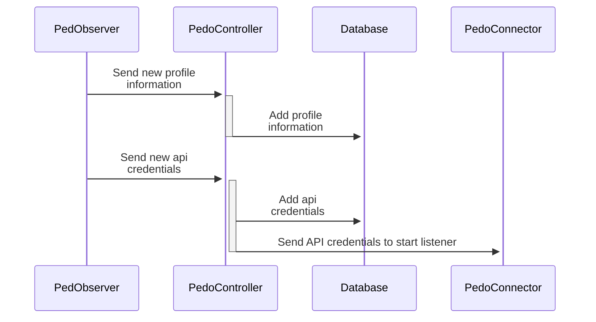
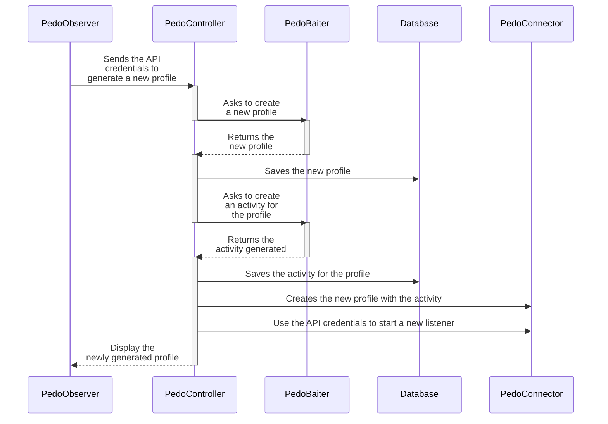

# PedObserver
## Sequence diagrams
### Use case: Manually create a new profile

```mermaid
sequenceDiagram
    PedObserver->>+PedoController: Send new profile <br>information
    activate PedoController
    PedoController->>+Database: Add profile <br>information
    activate Database
    deactivate PedoController
    activate PedoController
    PedObserver->>+PedoController: Send new api <br>credentials
    PedoController->>+Database: Add api <br>credentials
    PedoController->>+PedoConnector: Send API credentials to start listener
    deactivate PedoController
```

### Use case: Automatically generate a new profile with an activity

```mermaid
sequenceDiagram
    PedoObserver->>PedoController: Sends the API<br> credentials to <br>generate a new profile 
    activate PedoController
    PedoController->>PedoBaiter: Asks to create<br>a new profile
    deactivate PedoController
    activate PedoBaiter
    PedoBaiter-->>PedoController: Returns the <br>new profile
    deactivate PedoBaiter
    activate PedoController
    PedoController->>Database: Saves the new profile
    PedoController->>PedoBaiter: Asks to create<br>an activity for <br>the profile
    deactivate PedoController
    activate PedoBaiter
    PedoBaiter-->>PedoController: Returns the <br>activity generated
    deactivate PedoBaiter
    activate PedoController
    PedoController->>Database: Saves the activity for the profile
    PedoController->>PedoConnector: Creates the new profile with the activity
    PedoController->>PedoConnector: Use the API credentials to start a new listener
    PedoController-->>PedoObserver: Display the <br>newly generated profile
    deactivate PedoController
```
