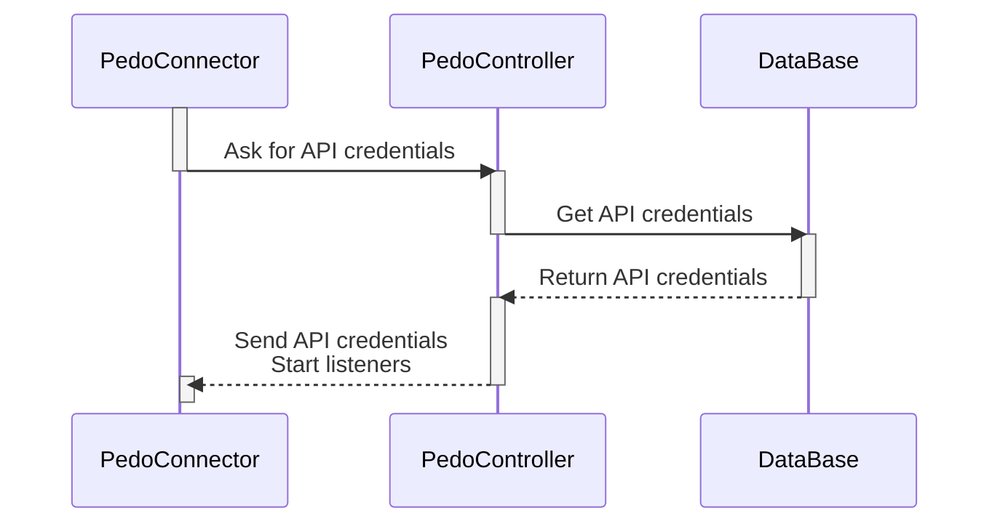

# PedoConnector

## Sequence diagrams of the project workflows
### Start Listeners

```mermaid
sequenceDiagram
    activate PedoConnector
    PedoConnector->>PedoController: Ask for API credentials
    deactivate PedoConnector
    activate PedoController
    PedoController->>DataBase: Get API credentials
    deactivate PedoController
    activate DataBase
    DataBase-->>PedoController: Return API credentials
    deactivate DataBase
    activate PedoController
    PedoController-->>+PedoConnector: Send API credentials<br>Start listeners
    deactivate PedoController
    activate PedoConnector
    deactivate PedoConnector
```