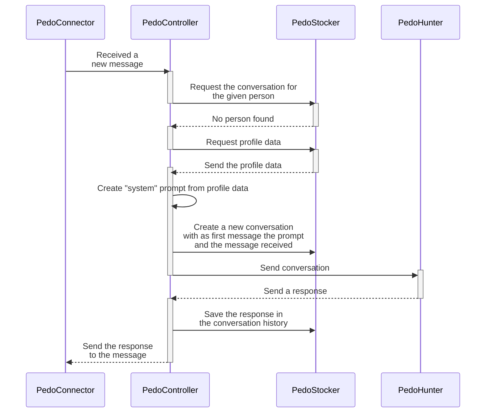
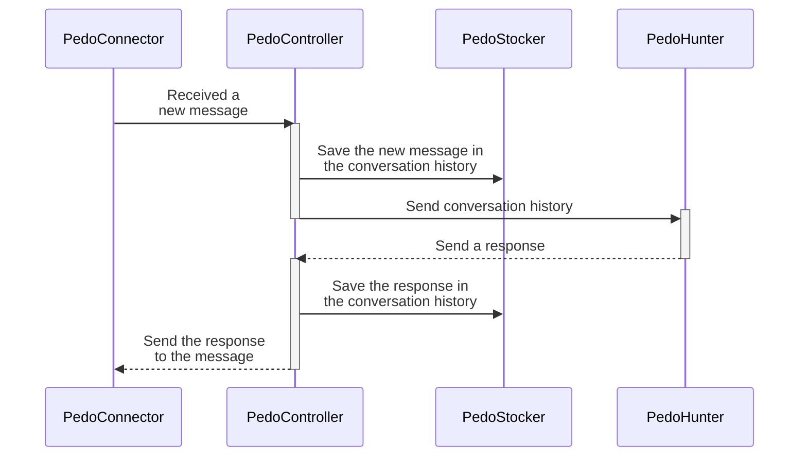

# PedoHunter

## Sequence diagrams of the project workflows
### Send a response to to a newly created conversation

### Send a response to a conversation


## API usage example

```bash
curl -X POST http://localhost:8000/chat \
  -H "Content-Type: application/json" \
  -d '{
    "messages": [
      {"role": "user", "content": "Hello, i am Luca"},   
      {"role": "assistant", "content": "I am an AI assistant"},
      {"role": "user", "content": "Who am i?"}               
    ]
  }'
```
```bash
"You are Luca! 😊 \n\nIt's nice to meet you. \n\nDo you want to tell me a little bit about yourself"
```
