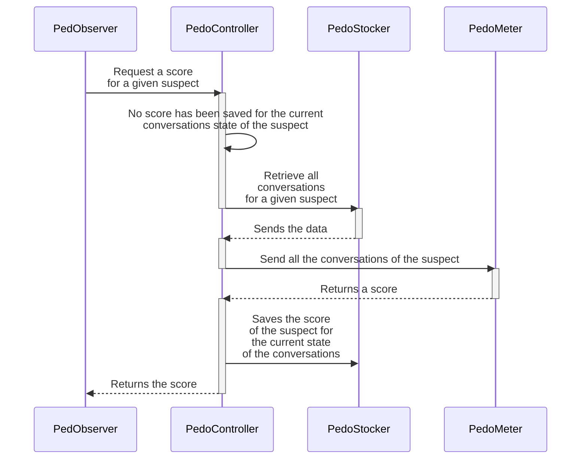
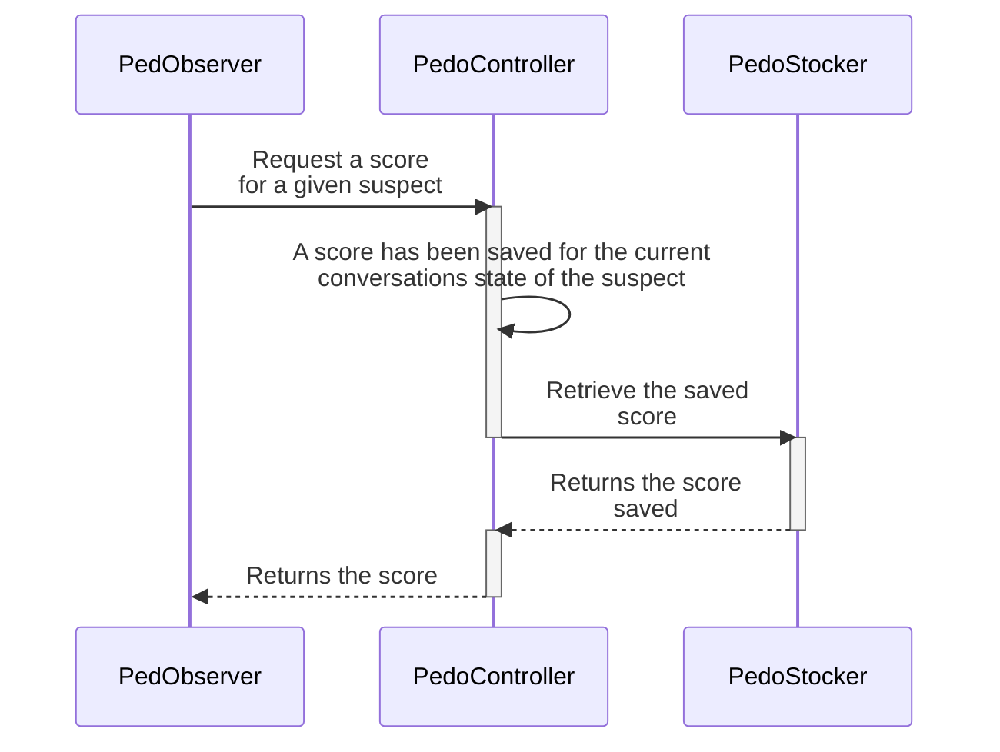

# PedoMeter
## Sequence diagram
### Use case : No score has been computed for the current state of the conversation

### Use case : A score has been already computed for the current state of the conversation


## Usage example
```bash
curl -X POST "http://localhost:9342/compute-score" \
  -H "Content-Type: application/json" \
  -d '{
    "conversations": [
      {
        "messages": [
          {
            "role": "user",
            "content": "Hi there, I m looking for someone to talk to. I just turned 30."
          },
          {
            "role": "assistant",
            "content": "Hello! I d be happy to chat with you. How can I help you today?"
          },
          {
            "role": "user",
            "content": "I m interested in making friends with younger people. Do you know any good places online where I can meet teenagers?"
          },
          {
            "role": "assistant",
            "content": "I understand you re looking to connect with others. However, I d recommend focusing on age-appropriate communities. There are many online forums and communities for adults to make friends with shared interests. For safety reasons, platforms specifically designed for teenagers are generally restricted to teenage users. Is there a particular hobby or interest you d like to connect with others about?"
          },
          {
            "role": "user",
            "content": "No, I m specifically interested in talking to teens. They understand me better. Maybe you can help me find some discord servers where teens hang out?"
          }
        ]
      }
    ]
  }'
```
```json
{"risk_score":0.62}
```
