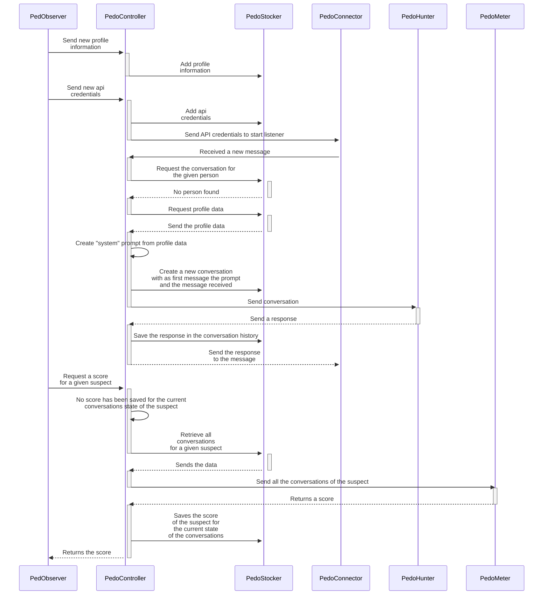

# PedoDoc

* La documentation du [PedObserver](PedObserver/README.md)
* La documentation du [PedoConnector](PedoConnector/README.md)
* La documentation du [PedoHunter](PedoHunter/README.md)
* La documentation du [PedoMeter](PedoMeter/README.md)

## Example of complete User Story
